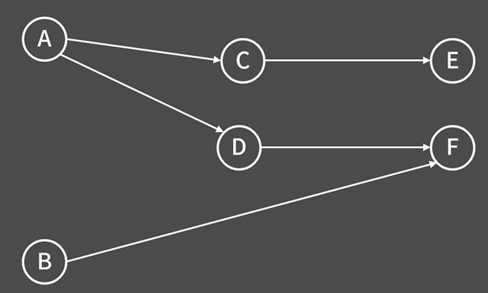
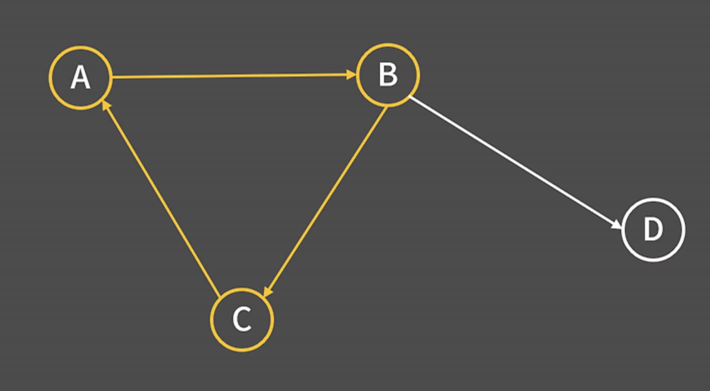

# 위상정렬

> [!NOTE]
>
> 방향 그래프에서 간선으로 주어진 정점 간 선후관계를 위배하지 않도록 나열하는 정렬

- 위상 정렬은 사이클이 존재하지 않는 방향 그래프에서만 잘 정의된다.
  - 왜? 어떤 것이 먼저 나오더라도 간선으로 주어진 정점 간 `선후관계에 모순`이 발생하기 때문
  - 사이클이 존재하지 않는 방향그래프를 `DAG`(Directed Acyclic Graph)라고 줄여서 부르기도 한다.

## 구현의 편의를 위한 성질

1. 정점과 간선을 실제로 지울 필요 없이 미리 indegree의 값을 저장했다가 매번 뻗어나가는 정점들의 indegree 값만 1 감소시켜도 과정을 수행 가능
2. indegree가 0인 정점을 구하기 위해 매번 모든 정점들을 다 확인하는 대신 목록을 따로 저장하고 있다가 직전에 제거한 정점에서 연결된 정점들만 추가

## 위상 정렬 알고리즘

1. 맨 처음 모든 간선을 읽으며 indegree 테이블을 채움
2. indegree가 0인 정점들을 모두 큐에 넣음
3. 큐에서 정점을 꺼내어 위상 정렬 결과에 추가
4. 해당 정점으로부터 연결된 모든 정점의 indegree 값을 1 감소시킴. 이때 indegree가 0이 되었다면 그 정점을 큐에 추가
5. 큐가 빌 때까지 3, 4번 과정을 반복

> [!NOTE]
>
> 시간복잡도: O(V + E)
