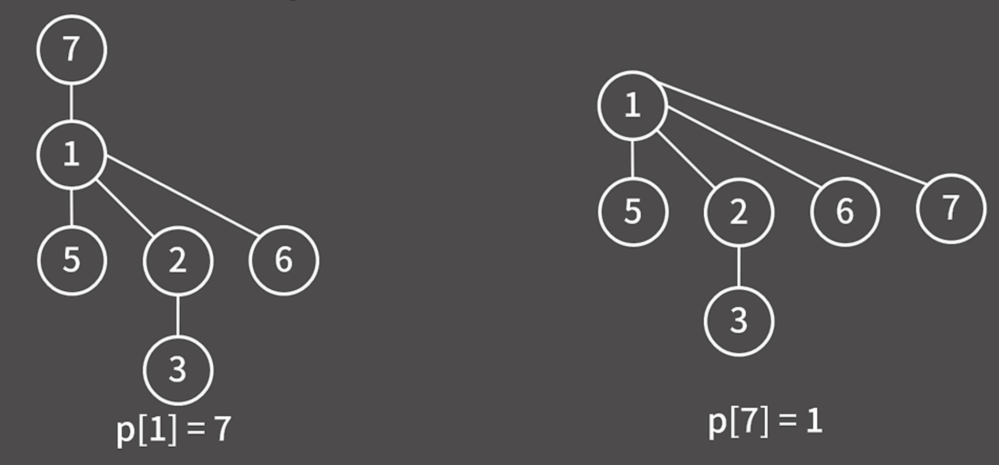

# Union-Find

> [!NOTE]
>
> Union 연산: 두 그룹을 합치는 연산
> Find 연산: 원소가 속해 있는 그룹을 알아내는 연산

## Before Union

- 배열에 각 원소의 그룹 번호를 써둔 다음, 연산이 주어질 때마다 처리하는 방식

- 1, 5를 union하는 경우, 5번 원소의 그룹을 1로 바꿔주면 됨.
- 편의상 Union할 뒷쪽 원소의 그룹을 앞쪽 원소의 그룹으로 합친다고 생각하자.

- Union 2,3을 하면 3번 원소의 그룹을 2로 바꾸면 됨

- 여기서 Union 1,3을 수행한다고 하면 3번 원소의 그룹만을 1번으로 바꾸면 이상함.
- Union 2,3으로 인해 2번과 3번 원소가 한 그룹이 되었기 때문에 2번 원소의 그룹도 바꿔줘야 함.
- 결국 지금의 구현방식은 Find -> O(1), Union -> O(N)

## Union

- 각 원소를 정점으로 생각하고 그룹은 트리로 표현한 다음 Union 연산이 발생할 때마다 한 트리의 루트가 다른 트리의 자식으로 들어가서 두 개의 트리가 합쳐진다.
- 이 트리 구조를 실제 코드로 저장할 때에는 각 원소에 대해 부모 정점의 번호를 담을 배열을 만들고 값을 적절하게 쓰면 된다.
- 처음에는 모든 원소에 대해 부모 정점이 없다는 뜻으로 -1을 채워둔다.

- Union 1,5를 하면 5번 정점을 1번 정점의 자식으로 만든다.

- Union 2,3을 하면 3번 정점을 2번 정점의 자식으로 만든다.

- Union 1,3을 하면, 이전과는 다르게 3번 정점이 속한 그룹의 루트인 2번 정점을 1번 정점의 자식으로 만들어야함.

- Union 2,6을 할때에는 6번 정점이 속한 그룹의 루트를 2번 정점이 속한 그룹의 자식으로 만들면 됨

## Find

- 현재 정점의 부모 정점이 누구인지 올라가며 확인하는 연산이다.
- 단순히 올라가게 된다면 O(N)의 시간복잡도를 갖게 되므로, Find 연산을 최적화하는 방법이 필요하다.

## 최적화 1 - Union by rank

- 위와 같은 상황에서 Union 7,2를 하게 된다고 해보자.

- Find 부분에서 설명했듯, 트리의 높이가 작은 쪽을 높은 트리의 자식으로 붙이는 것이 최적화에 좋다.
- 이 높이를 랭크라고 부른다.

- p 배열을 구성할 때, 부모 정점의 경우 -1 \* 랭크로 나타내자.

## 최적화 2 - 경로 압축

- Find를 할 때 경로를 압축해 효율적으로 동작하게 만드는 방법
- 경로 압축에서는 Find 연산을 할 때, 현재 정점의 부모 정점이 누구인지 확인하고, 그 부모 정점의 부모 정점이 누구인지 확인하는 식으로 계속 올라가면서, 최종적으로 루트 정점을 찾는다.
- 이때, 올라가는 과정에서 만난 정점들의 부모 정점을 모두 루트 정점으로 바꿔준다.

### 시간 복잡도

| 방법                     | 시간복잡도          |
| ------------------------ | ------------------- |
| 최적화 1 (Union by rank) | O(logN)             |
| 최적화 2 (경로 압축)     | Amortized O(log(N)) |
| 최적화 1 + 최적화 2      | Amortized O(α(N))   |

> [!TIP]
>
> Amortized ( 분할 상환 )는 연산을 한 번 할 때에는 운이 나쁘면 O(N)이 걸릴 수도 있습니다. 예를 들어 트리가 일자로 생겨있는 상황에서 리프 원소를 잡고 Find를 한다면 O(N)이 걸립니다. 하지만 Find를 하고 나면 트리의 높이가 2로 낮아지기 때문에 또다시 Find를 한다면 그 때에는 O(1)입니다. 이런식으로 M번의 연산을 할 때 매번 연산의 시간복잡도는 O(N), O(1), 이렇게 다양할 수 있지만 전체 시간을 합쳐보면 O(MlogN)이 된다는 의미입니다.
>
> α(N)는 아커만 함수의 역함수로, N이 커지면 커질수록 α(N)은 매우 느리게 증가합니다. 따라서 Union-Find의 시간복잡도는 사실상 O(1)이라고 볼 수 있습니다.
> N <= 2^2^2^65536 - 3 일때, α(N) <= 4
